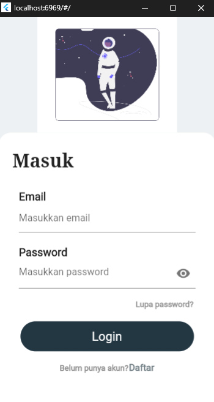
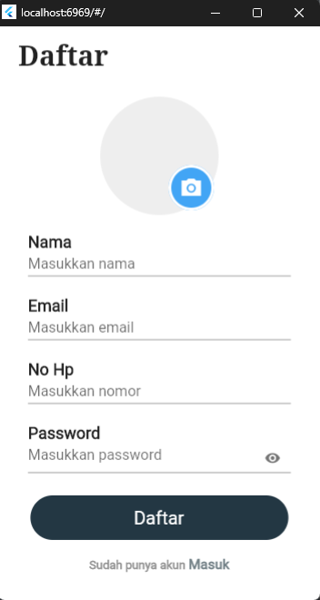
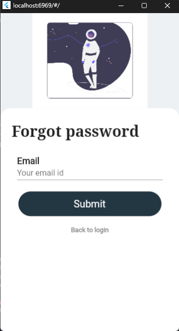

# UTS MOBILE FLUTTER (Login & Register)

**_Nama: Fajar Agung Nugroho_**  
**_Nim : 312010488_**  
**_Kelas : TI.20.A3_**  

 

## Introduction

Login Page dalam Flutter untuk membuat antarmuka pengguna yang memungkinkan pengguna untuk memasukkan informasi pengguna mereka, seperti nama pengguna dan kata sandi, untuk mengakses aplikasi atau platform yang terkait.

 

## Features

- Login
- Register
- Forgot Password

 

## Screenshots

 

### UI Design Figma

  
  
  

